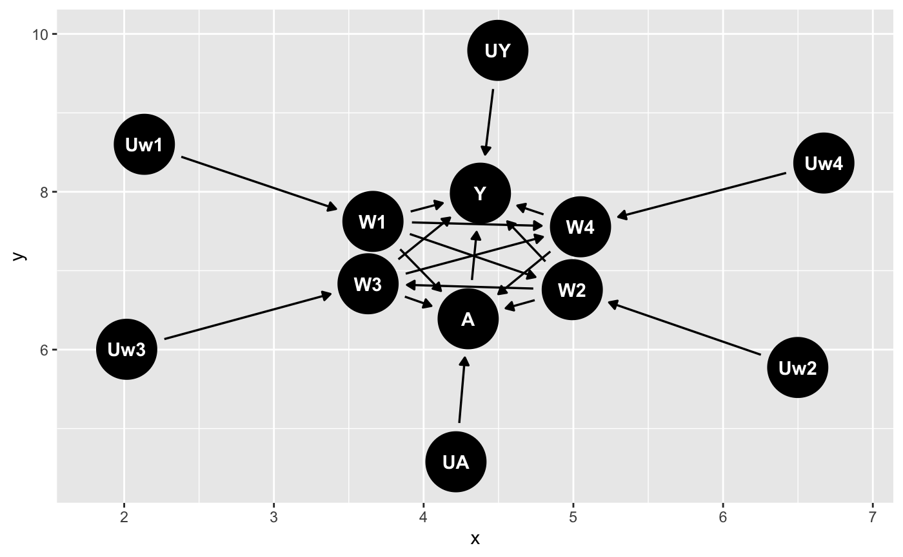
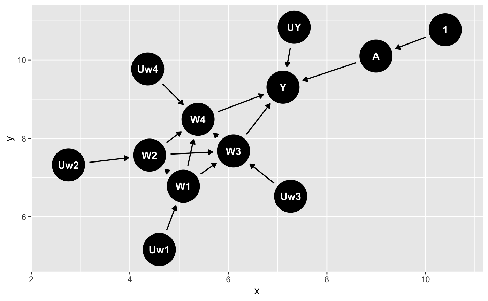
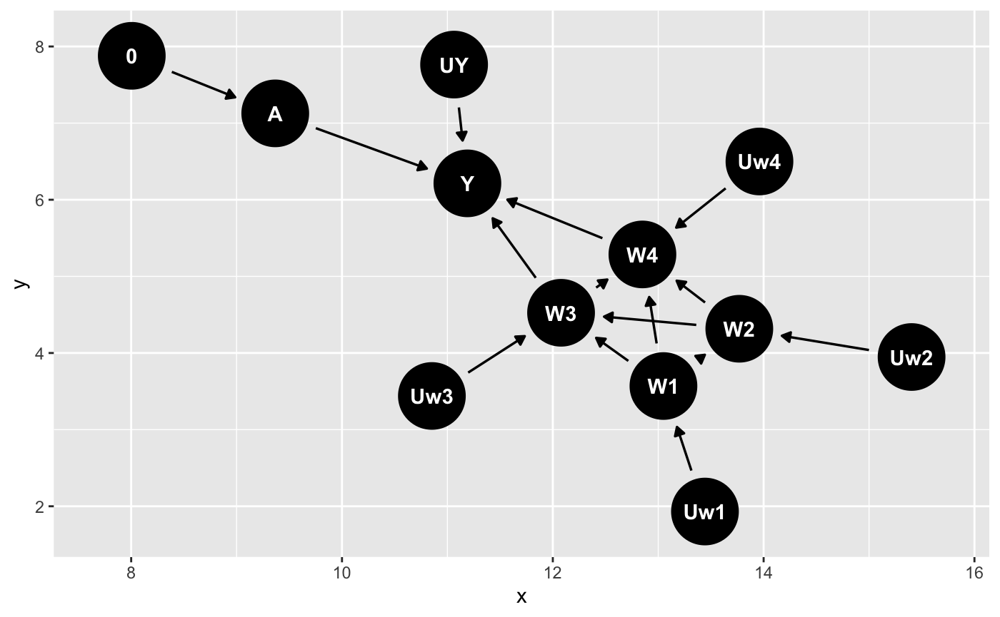

Discussion Assignment 1

WCM Modern Methods for Causal Inference

Tianran Zhang

Study 2: Effect of male circuscision on risk of HIV acquisition

## Step 0: State the scientific question.

**1. What causal question or questions was this research aiming to answer?**

The causal question this research aiming to answer is that does male circumcision reduce the incident HIV in a rural population. To be specific, the study population is the adult tea plantation workers and dependents in rural Kericho, Kenya.

**2. What makes this a causal question as opposed to a purely statistical question? Give an example of a purely statistical question that the research described could address. Is the language used by the authors in describing their objective causal or statistical?**

Data + statistical assumptions = statistical inference.

Data + statistical assumptions + **causal assumptions (non testable)** = causal inference. 

Causal inference requires untestable assumptions. Besides, statistical inference makes conclusions about an underlying population, while causal inference makes conclusions about how the underlying population would change if conditions changed. This study is interested in male circumcision in the prevention of heterosexual female-to-male HIV transmission. It focused on how the male HIV status would change if their circumcision status changed. So, this is a causal question as opposed to a purely statistical question.

An example of a purely statistical question that the research described could address:  "How likely were men who got circuscision to acquire HIV? "

In describing their objective, the author used statistical words and wrote "<u>*The Kericho HIV Cohort Study, described below, offers the opportunity to study the relation between male circumcision and incident HIV in a rural population. In this study, we examined the association between circumcision and HIV infection in a cohort of adult agricultural workers and dependents after 2 years of follow-up.*</u>"

**3. Specify the target population.** 

The target population is a rural population in sub-Saharan Africa. To be specific, 1378 male adult plantation workers and dependent volunteers aged 18 to 55 years, who were HIV-negative from the baseline cohort, and with completed data at the end of the study. 

This population is selected from 2801 adult plantation workers and dependent volunteers aged 18 to 55 years who were recruited over a 6-month period beginning in June 2003. For this 2-year follow-up sub-analysis, male circumcision study, we excluded all women (n = 1081) and HIV-positive men (n = 195) from the baseline cohort, volunteers who were lost during follow-up (n = 146), and any volunteer with incomplete data (n = 1), resulting in 1378 men for analysis. 

## Step 1: Specify a structural causal model (SCM) using the formal notation defined in class.

**4. What are the endogenous variables? What additional covariates besides those observed might be important? How would you incorporate them into the model?** 

Endogenous variables: variables that are meaningful for the scientific question, or about which we have some scientific knowledge. In this study, the endogenous variables are: $X = \{ W1, W2, W3, W4, A, Y\}$ 

W1: Religion

W2: Tribe

W3: Sex with a commercial sex worker

W4: Diagnosis with a sexually transmitted infection

A: Circumcision status

Y: HIV status at two years of follow-up

Additional covariates besides those observed such as income and educational status might be important since people with higher income and educational status might have higher chance in getting circumcisions. I would incorporate them as pre-intervention covariates in the SCM as W5: Income, W6: Educational Status. Endogenous variables $X = \{ W1, W2, W3, W4,W5, W6, A, Y\}$ .

**5. Discuss your exogenous/background variables U. What factors might be included? Did you observe your U? Could you observe your U?** 

Exogenous variables are all the unmeasured factors not included in X and determine the values that the X variables take. They are not affected by other factors in the model.

In this study, background (exogenous) variables are: $U = \{U_{W1}, U_{W2}, U_{W3}, U_{W4}, U_{A}, U_{Y}\}$  

Parents' religions, genetic predisposition to HIV, childhood, emotional diseases, etc might be included in the exogenous/background variables U. 

I did not observe U, and I could not observe them. 

**6. Specify your structural equations F. (Please be mindful of the notation used in class.) Do your structural equations make any assumptions about functional form?**

Structural equations: $F = \{f_{W1}, f_{W2}, f_{W3}, f_{W4}, f_{A}, f_{Y}\}$ 

$W1 \leftarrow f_{w1}(U_{w1})$  

$W2 \leftarrow f_{w2}(U_{w2}, W_1)$ 

$W3 \leftarrow f_{w3}(U_{w3}, W_1, W_2)$  

$W4 \leftarrow f_{w4}(U_{w4}, W_1, W_2, W_3)$ 

$A \leftarrow f_{w1}(U_A, W_1, W_2, W_3, W_4)$ 

$Y \leftarrow f_{w1}(U_{Y}, A, W_1, W_2, W_3, W_4)$ 

My structural equations does not make any assumptions about functional form. 

**7. Discuss any exclusion restrictions. In general, what are exclusion restrictions? What do they mean in words? For the study, do you feel that any are justified?** 

Exclusion restrictions: $X_j \leftarrow f_{X_j}(Pa(X_j), U_{X_j}), j = \{1, ..., J\}$ , $Pa(X_j) \subseteq X \setminus X_j$ 

Exclusion restrictions are the assumptions we made by leaving X variables out of a parent set. To be specific, excluding a variable from Pa(Xj) assumes it does not directly affect the value Xj takes.

For this study, I do not think there is any justified exclusion restrictions. 

**8. Discuss any independence assumptions. In general, what are independence assumptions? What do they mean in words? For the study, do you feel that any are justified? When might they be?**

Independence assumptions are the assumptions we made that restrict the allowed distributions for P*. For example, $U_A$  is independent of $U_Y$ corresponds to saying that A and Y share not common causes beyond the endogenous variable X.

For this study, I don't think there is any justified independence assumptions.  $U_1, U_2$ might be independent of $U_4$ . But we should avoid making any unsupported assumptions on the joint distribution of the errors P*.

**9. Draw at least one possible causal graph.**

The causal graph based on the structural equations F in question 6 is shown bellow: 

## Step 2: Define the target causal parameter.

**10. Specify the intervention node(s).**

The intervention node is A (Circumcision status).

**11. Specify the intervention(s) of interest.**

The intervention of interest:

Intervention 1: All men take circumcisions. (set A = 1)

Intervention 2: No man takes circumcisions. (set A = 0)

**12. Formally express this modification of experimental conditions as an intervention on the SCM and on the causal graph.**

The modification of experimental conditions as an intervention:

Intervention1: Intervene for all males to take circumcisions

on SCM: Intervene on the system to set $A \leftarrow 1$ ; Replace $f_A$ with constant function 1.

$W1 \leftarrow f_{w1}(U_{w1})$  

$W2 \leftarrow f_{w2}(U_{w2}, W_1)$ 

$W3 \leftarrow f_{w3}(U_{w3}, W_1, W_2)$  

$W4 \leftarrow f_{w4}(U_{w4}, W_1, W_2, W_3)$ 

$A \leftarrow 1$ 

$Y \leftarrow f_{w1}(U_{Y}, A = 1, W_1, W_2, W_3, W_4)$ 

on the causal graph:

Intervention2: Intervene for all males to not take circumcisions

on SCM: Intervene on the system to set $A \leftarrow 0$ ; Replace $f_A$ with constant function 0.

$W1 \leftarrow f_{w1}(U_{w1})$  

$W2 \leftarrow f_{w2}(U_{w2}, W_1)$ 

$W3 \leftarrow f_{w3}(U_{w3}, W_1, W_2)$  

$W4 \leftarrow f_{w4}(U_{w4}, W_1, W_2, W_3)$ 

$A \leftarrow 0$ 

$Y \leftarrow f_{w1}(U_{Y}, 0, W_1, W_2, W_3, W_4)$ 

on the causal graph:

**13. Specify your counterfactual outcomes under the intervention(s) of interest. How are these counterfactuals defined with an SCM? What do they mean (in words)?**

The conterfactual outcome $Y_a$ represents the value that variable Y would have taken if that individual had received treatment (exposure) A = a. 

The counterfactual outcomes defined with an SCM:

$Y_1: Y_1 \leftarrow f_{w1}(U_{Y}, 1, W_1, W_2, W_3, W_4)$ 

$Y_0: Y_0 \leftarrow f_{w1}(U_{Y}, 0, W_1, W_2, W_3, W_4)$ 

The counterfactual outcomes meanings in words: 

$Y_1$ : counterfactual HIV status for a male if possibly contrary-to-fact he took circumcision A = 1.

$Y_0$ : counterfactual HIV status for a male if possibly contrary-to-fact he did not take circumcision A = 0.  

**14. Using counterfactual notation, define a target causal parameter without using a marginal structural model. What does it mean (in words)?**

Define a target causal parameter using a marginal structural model: 

 $\theta^* = P^*(Y_1 = 1) - P^*(Y_0 = 1)$ . 

$\theta^*$ represents the causal risk difference. It means the difference in probabilities of diagnosing HIV between males who took circuscisions and those who did not take circuscisions. 

**15. Using counterfactual notation, define a target causal parameter using a working marginal structural model (MSM). What does it mean (in words)?** 

Define a target causal parameter using a working marginal structural model: 

$\beta^* = argmin_{\beta}E^*[\sum_{a \in A} (Y_a - m(a|\beta))^2]$ 

The causal parameter is the value of the coefficients that minimize the sum of squared residuals between the counterfactual outcomes $Y_a$ and the predicted $m(a|\beta)$ for all possible exposure levels $a \in A$ 

For the sake of simplicity, I assumed the expected counterfactual outcome is a linear function of a:

$m(a|\beta) = \beta_0 + \beta_1 a$ 

In this case, we need to determine which intercapt and slope best fits the relationship between the intervened treatment and counterfactual outcomes.  

## Study-specific Questions:

Note that when specifying your SCM, you do not need to incorporate loss to follow up, death or potential reporting bias. We will learn how to incorporate these later in the course.

**16. How would you formally incorporate the following information in your causal model: in this population men did not alter their sexual behavior because of their circumcision status? Do you think such an assumption is warranted here? Would it be warranted if there were a program implementing adult male circumcision as an HIV prevention strategy? If you are not sure, how would you incorporate this uncertainty in your model?**

Men did not alter ther sexual behavior because of their circumcision status means that circumcision status does not directly affect sexual behavior. To incorporate this information in the causal model, I would exclude A from $Pa(W_2 )$ and $Pa(W_3)$ , which means A does not directly affect the value $W_2, W_3$ takes, i.e. $A \not \in Pa(W_2), A \notin Pa(W_3)$ . 

However, this assumption is not warranted in this study, but it might be warranted if there were a program implementing adult male circumcision as an HIV prevention strategy. 

I would  leave A in $Pa(W_2 )$ and $Pa(W_3)$ , which just means A **might** affect the value $W_2, W_3$ takes.

**17. What makes the Kericho population a potentially interesting system to study (as compared, for example, to a population enrolled in a randomized trial)? What might make it less interesting or relevant than other populations? (Think about how you are hoping to use the results of this analysis.)**

As described by the author, generalizability of RCT results and experiences to populations with unique cultural and epidemiologic characteristics must be fully considered in the planning of any widespread prevention initiative. 

Public health stake holders must consider future policy recommendations regarding circumcision alone or in combination with other prevention measures in reducing the HIV burden in sub-Saharan Africa. The Kericho population offers the opportunity to study the relation between male circumcision and incident HIV in a rural population as compared to other population.  

However, if the purpose is to carry on the policy recommendations regarding circumcision alone or in combination with other prevention measures in reducing the HIV burden in some other populations such as people in Europe, then the Kericho population might be less interesting or relevant than other European populations.