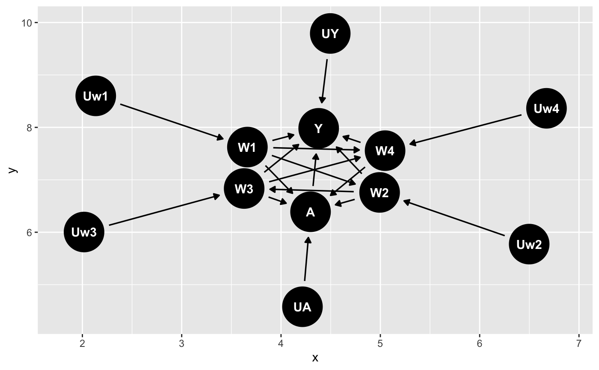

Study 2: Effect of male circuscision on risk of HIV acquisition

Tianran

Intro:

Male circumcision in the prevention of heterosexual female-to-male HIV transmission has received considerable attention throughout sub-Saharan Africa. 

Public health stake holders are considering future policy recommendations regarding circumcision alone or in combination with other prevention measures in reducing the HIV burden in sub-Saharan Africa. 

Generalizability of RCT results and experiences to populations with unique cultural and epidemiologic characteristics must be fully considered in the planning of any widespread prevention initiative. 

the Kericho HIV Cohort Study.

I investigated in the protective effect of male circumcision in reducing heterosexual transmission of HIV from women to men in a rural population based on the Kericho HIV Cohort Study.

This study was a 3.5-year observational, prospective cohort study aimed at estimating HIV prevalence, incidence, comorbidities, molecular epidemiology, and vaccine feasibility and acceptability among adult tea plantation workers and dependents in rural Kericho, Kenya. 

## Step 0: State the scientific question.

**1. What causal question or questions was this research aiming to answer?**

The causal question is to examine the association between circumcision and HIV infection in a cohort of adult agricultural workers and dependents after 2 years of follow-up.

**2. What makes this a causal question as opposed to a purely statistical question? Give an example of a purely statistical question that the research described could address. Is the language used by the authors in describing their objective causal or statistical?**

This research could also address some purely statistical questions. For example, is there an association between one's age and get HIV diseasein the study cohort. (Is this a statistical question?)

The language used by the authors in describin g their objective is causal. It says this study "aimed at estimating HIV prevalence, incedence, comorbities, molecular epidemiology, and vaccine feasibility and acceptability among ...",  the word "estimating" makes this study objective a causal question.

**3. Specify the target population.**

The target population is 1378 male adult plantation workers and dependent volunteers aged 18 to 55years, who was HIV-negative from the baseline cohort, and with completed data at the end of the study.

## Step 1: Specify a structural causal model (SCM) using the formal notation defined in class.

**4. What are the endogenous variables? What additional covariates besides those observed might be important? How would you incorporate them into the model?**

The endogenous variables in this study is religion (W1), tribe (W2), self-reported sexual activity including sex with a commercial sex worker (W3) and diagnosis with a sexually transmitted infection (W4). Circumcision status (A), and HIV status at two years of follow-up (Y). 

Additional covariates besides those observed such as income and educational status might be important. Since people with higher income and educational status might have higher chance in getting circumcisions. 

**5. Discuss your exogenous/background variables U. What factors might be included? Did you observe your U? Could you observe your U?**

$U = \{U_{W1}, U_{W2}, U_{W3}, U_{W4}, U_{A}, U_{Y}\}$ 

Parents' religions, genetic predisposition to HIV, childhood, emotional diseases, etc might be included in the exogenous/background variables U.

I did not observe U since I could not observe U​. (Could I ?)

**6. Specify your structural equations F. (Please be mindful of the notation used in class.) Do your structural equations make any assumptions about functional form?**

$F = \{f_{W1}, f_{W2}, f_{W3}, f_{W4}, f_{A}, f_{Y}\}$ 

$W1 \leftarrow f_{w1}(U_{w1})$ 

$W2 \leftarrow f_{w2}(U_{w2}, W_1)$ 

$W3 \leftarrow f_{w3}(U_{w3}, W_1, W_2)$  

$W4 \leftarrow f_{w4}(U_{w4}, W_3)$ 

$A \leftarrow f_{w1}(U_A, W_1, W_2, W_3, W_4)$ 

$Y \leftarrow f_{w1}(U_{Y}, A, W_3, W_4)$ 

I made assumptions 

**7. Discuss any exclusion restrictions. In general, what are exclusion restrictions? What do they mean in words? For the study, do you feel that any are justified?**

Exclusion restrictions are the assumptions we made by leaving X variables out of a parent set. To be specific, excluding a variable from Pa(Xj) assumes it does not directly affect the value Xj takes

For this study, religion and tribe do not directly affect one's diagnosis with a sexually transmitted infection and HIV status, i.e. $W_1, W_2 \not\in P_a(W_4), P_a(Y)$ . 

**8. Discuss any independence assumptions. In general, what are independence assumptions? What do they mean in words? For the study, do you feel that any are justified? When might they be?**

Independence assumptions are the assumptions we made that restrict the allowed distributions for P*. For example, $U_A$  is independent of $U_Y$ corresponds to saying that A and Y share not common causes beyond the endogenous variable X.

For this study, I don't think any are justified. But $U_1, U_2$ might be independent of $U_4$ .

**9. Draw at least one possible causal graph.**

The causal graph based on the structural equations F in question 6 is shown bellow: 

## Step 2: Define the target causal parameter.

**10. Specify the intervention node(s).**

The intervention node is A.

**11. Specify the intervention(s) of interest.**

The intervention of interest is taking circumcision for males.

**12. Formally express this modification of experimental conditions as an intervention on the SCM and on the causal graph.**

The modification of experimental conditions as an intervention:

on SCM: Intervene for all males involved in this research to take circumcisions (Set $A \leftarrow 1$ ). 

on the causal graph:

**13. Specify your counterfactual outcomes under the intervention(s) of interest. How are these counterfactuals defined with an SCM? What do they mean (in words)?**

The conterfactual outcome $Y_a$ represents the value that variable Y would have taken if that individual had received treatment (exposure) A = a. 

In this study,

$Y_1$ : counterfactual HIV status for a male if possibly contrary-to-fact he took circumcision A = 1.

$Y_0$ : counterfactual HIV status for a male if possibly contrary-to-fact he did not take circumcision A = 0.  

**14. Using counterfactual notation, define a target causal parameter without using a marginal structural model. What does it mean (in words)?**

Define a target causal parameter as the causal risk difference: $P^*(Y_1 = 1) - P^*(Y_0 = 1)$ . It means the difference in probabilities of diagnosing HIV between everyone took circuscision and that everyone did not take circuscision. 

**15. Using counterfactual notation, define a target causal parameter using a working marginal structural model (MSM). What does it mean (in words)?**

$\beta^* = argmin_{\beta} E^*[\sum_{a\in A}(P(Y_a = 1) - m(a, W_3, W_4 | \beta))^2]$ 

$m(a, W_3, W_4|\beta) = \beta_0 + \beta_1a + \beta_{W_3} + \beta_{W_4}$ 

I assumed the expected counterfactual outcome was a linear function of a, W3, and W4.

In words

## Study-specific Questions:

Note that when specifying your SCM, you do not need to incorporate loss to follow up, death or potential reporting bias. We will learn how to incorporate these later in the course.

**16. How would you formally incorporate the following information in your causal model: in this population men did not alter their sexual behavior because of their circumcision status? Do you think such an assumption is warranted here? Would it be warranted if there were a program implementing adult male circumcision as an HIV prevention strategy? If you are not sure, how would you incorporate this uncertainty in your model?**

Men did not alter ther sexual behavior because of their circumcision status means that circumcision status does not directly affect sexual behavior, i.e. $A \not \in W_2, W_3$ . This assumption is not warranted here, but it might be warranted if there were a program implementing adult male circumcision as an HIV prevention strategy. Since I an not sure about this, I would try two target causal parameter: one with xxx, and one with xxx, and compare their differences.

**17. What makes the Kericho population a potentially interesting system to study (as compared, for example, to a population enrolled in a randomized trial)? What might make it less interesting or relevant than other populations? (Think about how you are hoping to use the results of this analysis.)**

